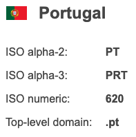

# Country flags

Simple Javascript/CSS script to display country flags (and also ISO country code info).

## How to use it

Copy the files inside the `/dist` folder into your project. In your HTML's `<header>` section, include the CSS script and the JS file:

    <link rel="stylesheet" href="country-flag.css">
    

### Displaying a flag

To display a flag image, choose an element in your layout which will be the parent of the DIV element containing the image and pass it to the `CountryFlag` constructor:

    const parentElement = document.getElementById("my-parent-element");
    const flag = new CountryFlag(parentElement);

Now you have a flag element ready to show a country flag. The final step is to tell which flag to load. You can do this based on the ISO alpha-2 country code:

    flag.selectByAlpha2("pt");

And the flag will be shown. You can also select a country be ISO alpha-3, ISO numeric code or by top-level domain:

    flag.selectByAlpha3("cub");
    flag.selectByIsoNumeric(388);
    flag.selectByTopLevelDomain("uk");

### Getting extra country info

Besides the flag, you can also query for the country's name (only available in English), alpha-2, alpha-3, ISO numeric and top-level domain. Just like with flag images, you can get a country by any of the available codes:

    CountryFlag.getCountryByAlpha2("br");
    CountryFlag.getCountryByAlpha3("usa");
    CountryFlag.getCountryByIsoNumeric(826);
    CountryFlag.getCountryByTopLevelDomain("de");

For example, this is data for Portugal:

Check the [example page](https://luciopaiva.com/country-flags) for a complete working example.

## Acknowledgements

Thanks [countrycode.org](https://countrycode.org) for providing free ISO data and [flag-sprites.com](https://www.flag-sprites.com/) for free flag images.
